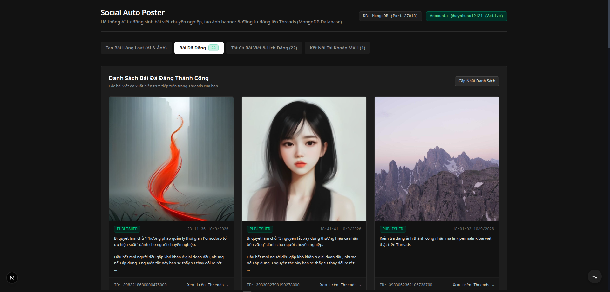
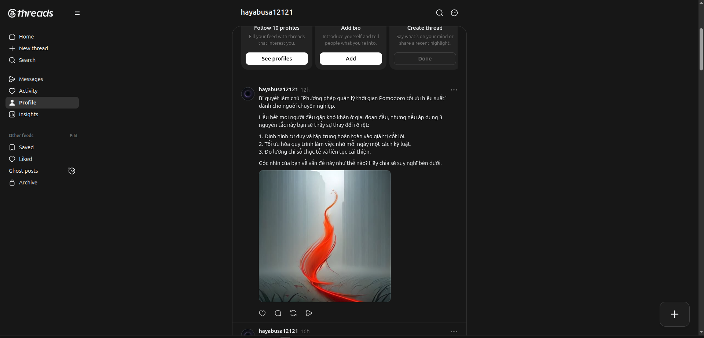
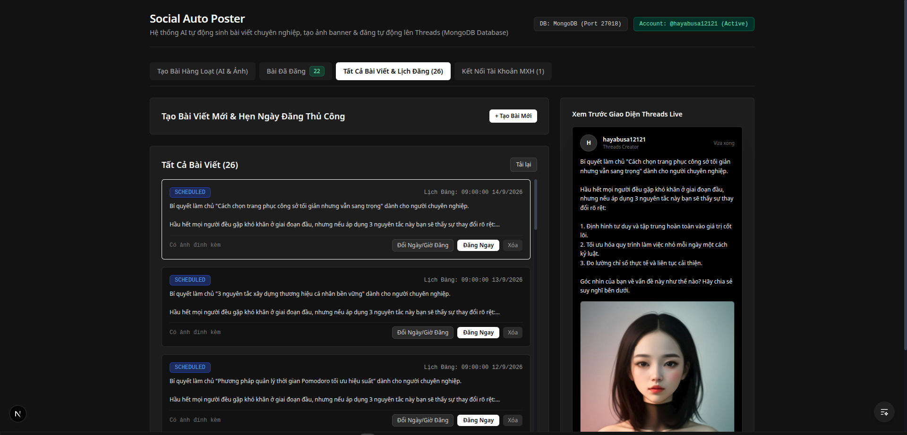
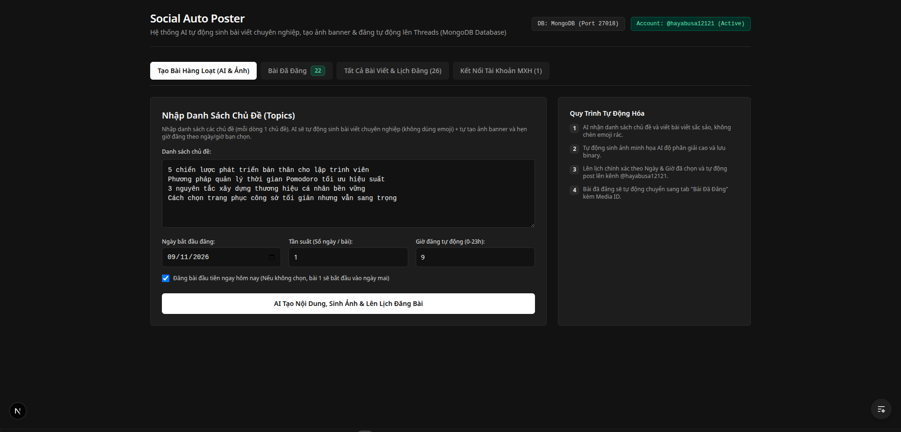

# 🚀 Social Auto Poster - AI Content & Social Media Distribution Platform

Nền tảng Fullstack tự động hóa 100% quy trình sáng tạo nội dung văn bản, sinh ảnh minh họa AI và phân phối bài viết hàng loạt lên mạng xã hội **Meta Threads**.

---

## 📸 Demo Giao Diện (Screenshots)

### 1. Dashboard Tổng Quan & Quản Lý Bài Viết


### 2. Sáng Tạo Nội Dung AI Hàng Loạt (Batch Generator)


### 3. Quản Lý Tài Khoản & Cấu Hình Kết Nối Meta Threads


### 4. Theo Dõi Lịch Đăng & Trạng Thái Tự Động (Cron Status)


---

## ✨ Tính Năng Nổi Bật

- 🤖 **Sáng Tạo Nội Dung Bằng Generative AI:** Tích hợp OpenAI GPT-4o và Google Gemini để tự động tạo ra bài viết truyền cảm hứng, chuyên nghiệp theo từng chủ đề.
- 🎨 **Tự Động Sinh Ảnh AI Minh Họa:** Tích hợp OpenAI DALL-E 3 và các engine sinh ảnh HD tự động tạo banner/ảnh minh họa đồng bộ với nội dung bài đăng.
- 🧹 **Bộ Lọc Văn Bản Chuẩn Hóa:** Tự động lọc sạch 100% Emoji/Icons thừa (`stripEmojis`), kiểm soát độ dài chuẩn mực dưới 480 ký tự theo quy định của Meta Threads.
- ⚡ **Cơ Chế Đăng Bài Đa Phương Thức (Multi-strategy Publisher):**
  - **Meta Graph API Official:** Workflow 2 bước (`createThreadsContainer` -> `publishThreadsContainer`).
  - **Internal Web API Reverse Engineering:** Giả lập HTTP Client đăng trực tiếp qua Session Cookie, Bearer Token và CSRF validation.
  - **Binary Rupload Stream Engine:** Nạp trực tiếp stream ảnh JPEG dạng `Buffer` lên server Instagram/Threads với thuật toán xử lý lỗi 4 tầng (4-layer fallback).
- 📅 **Lập Lịch Đăng Thông Minh (Smart Batch Scheduler):**
  - Nhập hàng loạt chủ đề (Topic List) hoặc Import file CSV.
  - Tự động giãn cách thời gian đăng (vd: 1 bài/ngày lúc 9:00 AM).
  - Background Cron Job (`@nestjs/schedule`) quét MongoDB mỗi 60 giây và đẩy bài đăng tự động.

---

## 🛠️ Công Nghệ Sử Dụng (Tech Stack)

### Backend
- **Framework:** Node.js, NestJS (TypeScript, Modular Architecture)
- **Database:** MongoDB & Mongoose ODM
- **AI Integration:** OpenAI API (GPT-4o, DALL-E 3), Google Generative AI (Gemini 1.5 Flash)
- **Task Scheduling:** `@nestjs/schedule` (Cron Jobs)
- **HTTP & Streaming:** Axios, Form-Data, Binary Buffers
- **Utilities:** `class-validator`, `class-transformer`, `csv-parse`

### Frontend
- **Framework:** Next.js 16 (App Router), React 19, TypeScript
- **Styling:** Tailwind CSS v4, PostCSS
- **Icons:** Lucide React

---

## ⚙️ Hướng Dẫn Cài Đặt & Chạy Dự Án

### Yêu Cầu Hệ Thống
- Node.js >= 20.x
- npm / pnpm / yarn
- MongoDB (chạy local hoặc MongoDB Atlas)

---

### 1. Cấu Hình Backend

```bash
cd backend

# Cài đặt thư viện dependencies
npm install

# Tạo file môi trường .env
cp .env.example .env # hoặc tạo mới file .env
```

Cấu hình các biến trong file `backend/.env`:

```env
PORT=3001
MONGODB_URI=mongodb://127.0.0.1:27017/social_auto_poster

# AI API Keys
OPENAI_API_KEY=sk-proj-xxxx...
GEMINI_API_KEY=AIzaSyxxxx...

# Threads Web Internal Credentials (Nếu dùng Reverse-engineered Direct Web API)
THREADS_SESSION_ID=your_session_id
THREADS_CSRF_TOKEN=your_csrf_token
THREADS_FB_DTSG=your_fb_dtsg
THREADS_LSD=your_lsd
```

Khởi chạy Backend ở chế độ Development:

```bash
npm run start:dev
```
Backend sẽ chạy tại: `http://localhost:3001`

---

### 2. Cấu Hình Frontend

```bash
cd ../frontend

# Cài đặt thư viện dependencies
npm install

# Khởi chạy Frontend ở chế độ Development
npm run dev
```
Frontend sẽ chạy tại: `http://localhost:3000`

---

## 📖 Hướng Dẫn Sử Dụng Chi Tiết

1. **Kết Nối Tài Khoản:**
   - Truy cập `http://localhost:3000`.
   - Nhập Meta Access Token hoặc thông tin Session Cookie / CSRF Token của Threads trong mục Quản lý Tài khoản.
2. **Tạo Lịch Đăng Hàng Loạt:**
   - Chọn mục **Batch Generator**.
   - Nhập danh sách các chủ đề (hoặc tải lên từ file CSV).
   - Đặt thời gian giãn cách (ví dụ: `1 ngày / 1 bài`) và khung giờ đăng (ví dụ: `9:00 AM`).
   - Nhấn **Generate & Schedule** để AI sinh nội dung + tạo ảnh và lên lịch vào Database.
3. **Tự Động Phân Phối:**
   - Hệ thống Cron Job ngầm sẽ tự động kiểm tra MongoDB theo từng phút.
   - Khi bài viết đến giờ hẹn (`scheduledAt <= now`), bài đăng sẽ tự động được xuất bản lên Threads mà không cần thao tác tay.

---

## 📜 Giấy Phép (License)

Dự án được phát hành dưới bản quyền **UNLICENSED** / Nội bộ.
